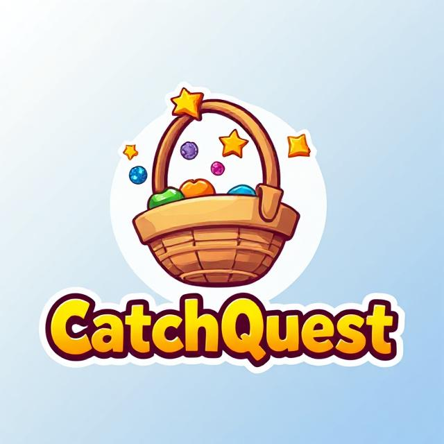

# 🎮 CatchQuest

**CatchQuest** is a fun and fast-paced **shapes catching game** built using **Pygame**, where the player controls a paddle to catch falling shapes and earn points. The game features smooth controls, clean visuals, sound effects, and a responsive interface that makes it perfect for casual play and demonstration.

---

## 🧠 Inspiration

This project was created as part of **Code in Place 2025** — a fantastic learning experience that helped me grasp the core concepts of Python and game development.  
A big **thank you** to the **Code in Place 2025** team! 🙏 Your teachings, support, and curriculum made it possible for me to bring this project to life.

---

## 🧩 Features

- 🎮 **Catch falling shapes** using your paddle  
- 🚀 Increasing difficulty for added challenge  
- 🎵 Sound effects to enhance gameplay  
- 📈 **Score tracking** and display  
- 🔁 **Restart option** to play again instantly  
- ✨ Smooth Pygame animations and UI  

---

## 🎥 Demo

▶️ [Watch Gameplay Demo](https://github.com/MananHere576/Code-In-Place-2025-Project/blob/main/CatchQuest%20-%20Video.mp4)  
*(Recorded from the working version of the game)*

---

## 🛠️ Technologies Used

- [Python](https://www.python.org/)
- [Pygame](https://www.pygame.org/) – used for game loop, rendering, and event handling

---

## 🚀 Getting Started

### 1. Clone the Repository
- git clone https://github.com/MananHere576/Code-In-Place-2025-Project.git
- cd Code-In-Place-2025-Project

### 2. Install Dependencies
- pip install pygame
###3. Run the Game
- python main.py

---

## 📁 Project Structure

CatchQuest/
│
├── main.py                  # Game logic
├── CatchQuest.jpg           # Preview image
├── CatchQuest - Video.mp4   # Gameplay recording
└── README.md

---

## 🏁 Controls
-🟰 Move the paddle left and right using arrow keys

-⏹️ Catch the shapes to earn points

-🔁 Press R to restart after game over

---

## 🙌 Special Thanks
-🎓 Code in Place 2025 — For the amazing Python journey

### 🧑‍🏫 The instructors and volunteers — Your dedication made learning engaging and impactful

“Learning by building is the best kind of learning.”
— Thanks, Code in Place! ❤️
